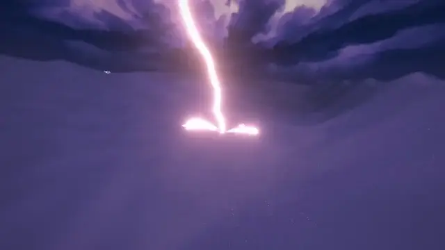
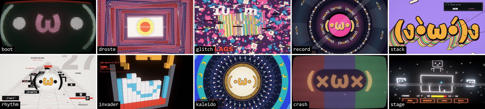

<div align="center">



# 小铭的视频基础引擎

**用代码一帧一帧画出音乐视频。**

由 **[XIAOMING6680](https://github.com/xiaoming6680)** 整理和制作

<sub>上面是用它做的四支 MV，全部是代码实时画的（无声，[高清版](docs/media/showreel.mp4)）</sub>

[作品](#作品) · [能做什么](#能做什么) · [快速开始](#快速开始) · [做自己的 MV](#做一支自己的-mv) · [和 AI 一起做](#和-ai-一起做) · [文档](#文档)

</div>

## 这是什么

给它一首歌，它分析出节拍、小节、段落、每一下鼓点和每个词的起止时间；你用 TypeScript 写场景，画面就跟着音乐走。

不用视频生成模型，也不用素材视频：每一帧都是 three.js、Canvas 2D 和着色器当场画出来的。所以能卡到每一拍，任意一帧都能单独渲染和修改，导出 4K、带运动模糊。

适合想做**原创**代码 MV 的人：画风、镜头、叙事都由你（或你的 AI 助手）自己设计，引擎负责音乐分析、渲染、检查和发布这些重复的活。

## 作品

| 作品 | 音乐 | 画面 |
|---|---|---|
| **游戏是你的解药吗？** | Zedd, VALORANT, Foxes – Clarity (BUNT. Remix) | 凌晨的健康游戏提醒一个个弹出，点下「继续游戏」被拽进游戏：键盘、赛车、发光线条隧道，英文歌词和场景联动 |
| **Falling Again** | NURKO, Roniit – Falling Again | 3D：低空掠过沙漠，云海、隧道、闪电，一镜到底 |
| **Still Shining** | Mayonazy / Levia / 重音テト – Still Shining (Levia Remix) | 竖版：在两座城之间坠落，穿过云层和城市，巨型字歌词 |
| **醒着** | きくお – 暗叫（纯音乐） | 一镜到底的黑白木刻：凌晨亮着灯的城市，每扇窗里独自扛着的人 |


## 能做什么

- **跟着音乐走**：节拍、小节、段落、底鼓 / 军鼓 / 镲的起音、各声部能量，场景里随时取用；段落还能自动出草稿
- **逐词歌词**：唱到哪个词亮到哪个词，中英双语排版
- **2D 和 3D 现成模块**：手绘抽帧、纸片剧场、巨型字、油画滤镜；相机路径、景深、体积光、云海、地形、体素、碎裂和传送门转场、MMD 角色
- **复古 / 字符 / 故障 / 像素**：CRT、字符画、VHS、冲击帧、万花筒、音游界面、被 3D 镜头拍的像素世界
- **检查和发布**：卡点偏差、响度、闪光、接缝检查、对照参考视频；抖音版合成、封面排版

## 快速开始

需要 [bun](https://bun.sh)、Edge 或 Chrome（渲染用）、[ffmpeg](https://ffmpeg.org)（导出视频用）。只看示例的话，Python 先不用装。

```bash
git clone https://github.com/xiaoming6680/xm-video-engine.git
cd xm-video-engine/app
bun install
bunx vite
```

打开终端打印的地址（通常是 <http://localhost:5173>），空格播放。仓库自带一首合成的测试曲和两段示例：跟着小节落下的方块和逐词高亮的歌词，后面是立在沙丘上的体素字。加 `/?ref=boot` 看[效果练习](#效果练习)里的一段。


导出一段视频（在 `app/` 里）：

```bash
bun scripts/render-par.ts --samples auto --out ../out/demo.mp4
```

## 做一支自己的 MV

```bash
python tools/new_project.py ../我的新MV     # 1. 建项目（竖版加 --vertical）
```

2. 歌放成 `audio/song.wav`，跑 `analysis/` 里的脚本：分离人声、分析节拍和段落、对齐歌词
3. 在 `docs/TREATMENT.md` 写方向，先做几个 10–15 秒带声音的样片挑方向
4. 全片粗分镜定结构，再挑两三个关键镜头做到成片质量，定下这支片的画面标准
5. 在 `app/src/scenes/` 写场景、`app/src/timeline.ts` 排时间线，一段段精做
6. 预览、检查、导出 4K，合成抖音版；在 `app/src/config.ts` 的 `CREDIT` 填你的署名，封面和角落水印会用它

用自己的歌要装 Python 依赖：

```bash
pip install numpy scipy librosa soundfile torch torchaudio audio-separator opencv-python Pillow fonttools
```

每一步的命令见 [使用指南](docs/使用指南.md)，完整流程和检查点见 [新项目流程](docs/新项目流程.md)。

## 和 AI 一起做

我自己是在 Claude Code 里用它做 MV 的：我讲想法和修改意见，它写场景代码、渲染静帧看图、一轮轮改。仓库里的 [CLAUDE.md](CLAUDE.md) 和新项目自动生成的 `CLAUDE.md` 都是写给它的。

- **放手让它设计**：方向样片让它给几个差别大的方向；画面标准就是你在打样那步确认的镜头，不用拿别的片子当下限
- **两步停下来看**：方向样片和全片粗分镜，动起来的东西越早看，越少推翻
- **要照着参考视频复刻时**：仓库带了技能 `.claude/skills/mv-refmatch`（单帧像 + 连贯 + 运动量接近），新项目里也有
- **别把整首歌词贴进对话**：脚本只按行号和时间处理歌词，AI 大段照抄歌词可能被内容过滤拦下

更多见 [使用指南 · 用 AI 编程助手来做](docs/使用指南.md#用-ai-编程助手来做)。

## 效果练习

照着两支参考视频练手的十段字符 / 故障 / 像素效果，同样全部由代码生成，点图打开（33 秒，无声）。代码是重写的，界面文字换成了自己的；它们是这些模块的写法示例，不是新片的画面标准。

<a href="docs/media/ref-demo.mp4"></a>

## 文档

| 文档 | 讲什么 |
|---|---|
| [使用指南](docs/使用指南.md) | 按键、做 MV 的每条命令、写场景入门、效果在哪、常见问题 |
| [新项目流程](docs/新项目流程.md) | 从一首歌到发布的完整步骤和检查点 |
| [引擎指南](docs/引擎指南.md) | 写场景：API、确定性、运动模糊、4K、排版 |
| [模块目录](docs/模块目录.md) | 全部 2D / 3D 模块和 Python 工具 |
| [复刻配方](docs/复刻配方.md) | 复古 / 字符 / 故障 / 像素效果的零件和写法，照参考视频复刻时的对照方法 |
| [质量验收](docs/质量验收.md) | 每轮预览查什么 |
| [制作方法](docs/方法.md)、[TREATMENT 模板](docs/TREATMENT模板.md) | 导演手法、素材、创意方案 |
| [模型选型](docs/模型选型.md) | 分析 / 抠图 / 深度用哪个模型、为什么、许可证 |
| [返工记录](docs/返工记录.md) | 做过的几支片子被提过什么意见，各条规矩怎么来的 |

## 作者与致谢

**[XIAOMING6680](https://github.com/xiaoming6680)** 整理了这套引擎，并制作了其中一部分：在 pdoom-video 的引擎核心上，合并了自己做《游戏是你的解药吗？》《Falling Again》《Still Shining》时写的扩展；写了音频分析、歌词对齐、质检、参考对照、抖音合成、封面这些工具；整理了中文文档和整套制作流程。转载或基于它做衍生项目时，请按 MIT 许可保留 [LICENSE](LICENSE) 里的署名。

- 引擎核心来自 [mexicat/pdoom-video](https://github.com/mexicat/pdoom-video)（Giacomo Magnanini，MIT），MV《I'm Upping My P(doom)》的渲染引擎；中文版见 [Zh-CN-pdoom-video](https://github.com/xiaoming6680/Zh-CN-pdoom-video)
- 效果练习照着 B 站视频《当 (•ω•) 被运行之后……》和 [guiguisocute/bad-time-mv](https://github.com/guiguisocute/bad-time-mv) 的画面手法练习，代码都是重写的，没有用它们的画面素材、音乐和文案
- `third_party/` 收录了 [Lemo-Opuscar](https://github.com/lemomo-ai/lemo-opuscar)、[Papermotion](https://github.com/francozanardi/papermotion)、[claude-animation-skill](https://github.com/buildwithhanif/claude-animation-skill)、[Clearwater](https://github.com/Aureliengmz/clearwater)、[ClaudeAnimationBase](https://github.com/JohnHeibel/ClaudeAnimationBase) 的代码（均为 MIT）

## 许可

代码按 [MIT](LICENSE) 发布，版权归 Giacomo Magnanini（引擎核心）和 XIAOMING6680（扩展、工具、文档）；`third_party/` 保留各自的许可（都是 MIT）。`app/public/fonts/` 里的字体为 OFL（Hershey 单线字体为 OFL / 公有领域）。`audio/`、`data/` 里是脚本合成的测试曲，不含任何歌曲。集锦里的 MV 画面是作者自己的作品，不含歌曲音频。
