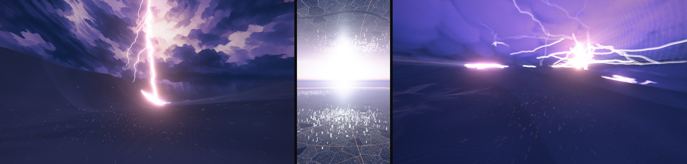
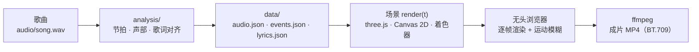
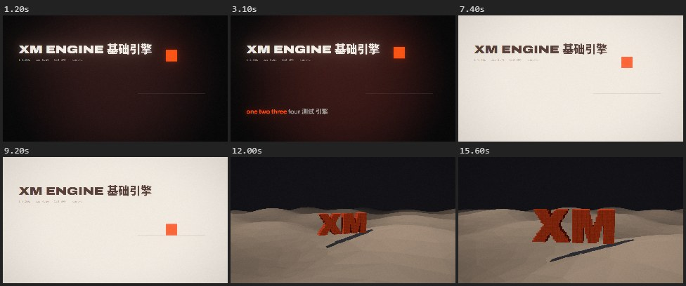

<div align="center">



# 小铭的视频基础引擎

**用代码一帧一帧画出音乐视频。**

画面跟着歌的节拍、段落和逐词歌词走，不用视频生成模型，也不用素材视频。<br>
2D、3D、横版、竖版都能做，导出 4K、带运动模糊。

[装环境](#装环境) · [跑起示例](#跑起示例) · [做一支自己的 MV](#做一支自己的-mv) · [写场景入门](#写场景入门) · [常见问题](#常见问题)

</div>

<sub>上图截自用这套引擎做的 MV：《Falling Again》《Still Shining》。引擎核心来自 MV《I'm Upping My P(doom)》，它的中文版见 [Zh-CN-pdoom-video](https://github.com/xiaoming6680/Zh-CN-pdoom-video)。</sub>

## 它能做什么

- **跟着音乐走**：自动分析歌曲的节拍、小节、段落、各声部起音（底鼓、军鼓、镲……）和能量包络，场景里随时取用
- **逐词歌词**：歌词对齐到每个词的起止时间，唱到哪个词亮到哪个词；中英双语排版、中文逐字出现
- **任意一帧都能单独渲染**：画面是时间的纯函数，可以随意拖动预览、并行导出，导出时自动加运动模糊
- **2D 和 3D 都有现成模块**：手绘抽帧、纸片剧场、精灵视差、巨型字排版、油画滤镜、动画线稿；相机路径、景深、体积光、体积云海、镜头虚化、日出光束、地形、体素、碎裂和传送门转场、MMD 模型
- **检查和发布工具**：卡点偏差、响度、闪光频率、抖音码率下的色带；抖音版合成、封面排版

## 它是怎么工作的



每个场景是一个 TypeScript 类，负责歌里的一段时间。引擎给它当前时刻的节拍、鼓点和歌词，它把这一帧画出来。

做一支 MV 就是：准备歌 → 跑分析脚本 → 写场景、排时间线 → 预览 → 导出。下面按这个顺序走一遍。

## 装环境

| 软件 | 用来 | 什么时候需要 |
|---|---|---|
| [bun](https://bun.sh)、Node.js | 预览服务器、渲染脚本 | 一直需要 |
| Microsoft Edge 或 Chrome | 无头浏览器逐帧渲染 | 渲染静帧、导出视频 |
| [ffmpeg](https://ffmpeg.org)（带 libx264） | 编码成 MP4 | 导出视频 |
| Python 3 和下面这些包 | 分析歌曲、对齐歌词、检查和发布工具 | 用自己的歌时 |

```bash
pip install numpy scipy librosa soundfile torch torchaudio audio-separator opencv-python Pillow fonttools
```

人声分离模型约 400 MB，第一次运行时自动下载，之后所有项目共用这一份。只想先看看示例的话，Python 可以先不装。

## 跑起示例

```bash
git clone https://github.com/xiaoming6680/xm-video-engine.git
cd xm-video-engine/app
bun install
bunx vite
```

打开终端打印的地址（通常是 <http://localhost:5173>）。仓库自带一首合成的测试曲和两段示例画面：先是跟着小节落下的方块和逐词高亮的歌词（2D），后面是立在低多边形沙丘上的体素字（3D）。



| 按键 | 作用 |
|---|---|
| 空格 | 播放 / 暂停 |
| ← / → | 后退 / 前进 1 秒，按住 Shift 是 5 秒 |
| `,` / `.` | 逐帧后退 / 前进 |
| `[` / `]` | 跳到上一个 / 下一个场景 |
| `l` | 循环当前场景 |
| `h` | 隐藏界面 |

网址加 `?t=12` 从第 12 秒开始；打开 `/?sky` 是天空示例（云海、空气光点、日出光束、镜头虚化）。

再试试渲染（在 `app/` 里运行）：

```bash
bun scripts/render.ts stills --t 3.1,12 --out ../out/stills     # 两张静帧 PNG
bun scripts/render-par.ts --samples auto --out ../out/demo.mp4  # 整段视频：多进程并行，带运动模糊
```

## 做一支自己的 MV

### 1. 建项目

在引擎目录运行：

```bash
python tools/new_project.py ../我的新MV   # 竖版（抖音）加 --vertical
cd ../我的新MV/app && bun install
```

新项目是引擎、分析脚本和工具的一份独立拷贝，随便改都不影响基础引擎。项目设置集中在 `app/src/config.ts`：画布尺寸、视频在歌里的起止、输出文件名。

### 2. 放歌，生成节拍和歌词数据

把歌转成 `audio/song.wav`（44.1 kHz），在项目根目录依次运行：

```bash
python analysis/separate.py vocals   # 分出人声和伴奏
python analysis/separate.py demucs   # 分出鼓、贝斯、其他、人声四轨
python analysis/analyze.py --bars    # 打印每小节的特征表，照着它在 analyze.py 开头填 SECTION_BARS（前奏、主歌、副歌……）
python analysis/analyze.py           # → data/audio.json：节拍、强拍、段落、能量包络
python analysis/ctc_align.py         # → data/lyrics.json：每个词的起止时间
python analysis/events.py --bars     # → data/events.json：底鼓、军鼓、镲……每一下的时间；对着表听，不准就调阈值
```

歌词对齐要先准备 `data/lyrics.src.lrc`：带逐行时间的 LRC 歌词，行时间大致准就行。FLAC 里内嵌了歌词的话可以直接导出：

```bash
ffprobe -v quiet -show_entries format_tags=LYRICS -of default=nw=1:nk=1 歌.flac > data/lyrics.src.lrc
```

- 逐词对齐目前只支持英文歌词；和英文行同一时间戳的中文行会作为译文一起保存，排双语歌词用
- AI 生成的歌（人声卡得很准）再跑一次 `python analysis/snap_words.py`，把词吸附到 16 分音符格上
- `events.py` 排在歌词对齐之后：它找人声切片时要避开唱词，歌词时间改过就重跑一次
- 纯音乐跳过歌词这一步，引擎没有歌词文件也能跑
- 跑完用 `cd app && bun scripts/render.ts info` 看一眼：时间线和每行歌词的时间、字数

### 3. 定方向

在 `docs/TREATMENT.md`（建项目时从模板生成）里写下一句话概念、色彩和分镜表。不是必须的，但先想清楚再写代码，返工会少很多。可以借鉴的做法见 [制作方法](docs/方法.md)。

### 4. 写场景，排时间线

在 `app/src/scenes/` 写自己的场景（写法见[下一节](#写场景入门)），删掉示例 `demo*.ts`，然后在 `app/src/timeline.ts` 安排每个场景占哪段时间：

```ts
return [
  E('intro', 'pulse', 0, au.timeOfBar(8)),            // 场景 id、场景文件名、开始、结束（歌曲秒）
  E('drop',  'city',  au.timeOfBar(8), au.duration),  // 8 小节后在强拍上硬切到下一个场景
];
```

首尾相接就是硬切，时间重叠就自动交叉淡化。时间尽量从数据里算（第几小节、某句歌词的开头），少写死秒数。

### 5. 预览、检查、导出

```bash
cd app
bunx vite                                              # 边改边看，保存就刷新
bun scripts/render.ts stills --t 12.5,13 --only drop   # 只渲染某个场景的几帧，放大细看
bun scripts/render-par.ts --samples auto --max-samples 36 --shutter 0.5 --out ../out/draft/v1.mp4   # 草稿
bun scripts/render-par.ts --samples auto --scale 2 --out ../out/final.mp4                           # 4K 成片
```

导出后回到项目根目录检查：

```bash
python tools/qa/review.py out/draft/v1.mp4        # 联系表和运动量曲线：整片有没有起伏
python tools/qa/check_video.py out/draft/v1.mp4   # 响度、真峰值、闪光、空帧、色彩标签
```

每轮预览对照 [质量验收清单](docs/质量验收.md) 过一遍。

### 6. 发布

- 抖音版（选段、锐化、淡出）：`python tools/douyin_mux.py out/final.mp4 audio/song.wav -o out/抖音版.mp4`
- 封面（抖音 4:3 / 3:4，B 站 16:9）：`python tools/cover_title.py <4K 静帧> --line1 标题 --line2 副标题 --tag 歌名 --by 作者`

每一步的细节和坑见 [新项目流程](docs/新项目流程.md)。

## 写场景入门

一个场景就是 `app/src/scenes/` 里的一个文件，默认导出一个继承 `Scene` 的类。引擎每一帧调用一次 `render(f, out)`：

```ts
import type * as THREE from 'three';
import { Scene, type Frame } from '../engine/scene';
import { FSPass, Layer2D, W, H } from '../engine/gl';
import { F, font } from '../engine/type';
import { rgba } from '../engine/palette';

export default class Pulse extends Scene {
  // 全屏着色器当背景：底鼓一响，画面亮一下
  bg = new FSPass(`uniform float kick;
    void main() { fragColor = vec4(mix(C_INK, C_SIGNAL, kick * 0.5), 1.0); }`, { kick: { value: 0 } });
  text = new Layer2D();   // 一层 Canvas 2D，用来写字

  render(f: Frame, out: THREE.WebGLRenderTarget) {
    const { renderer, comp, lyrics } = this.ctx;
    this.bg.u.kick!.value = f.a.kick;
    this.bg.render(renderer, out);

    // 正在唱的这一句，写在画面下方
    const c = this.text.ctx;
    this.text.clear();
    const line = lyrics.lineAt(f.t);
    if (line) {
      c.font = font(F.archivo(100, 700), 64);
      c.fillStyle = rgba('bone');
      c.fillText(line.text, W * 0.08, H * 0.8);
    }
    comp.draw(renderer, this.text.upload(), out);   // 文字叠到背景上
  }
}
```

场景里能拿到的东西：

| 写法 | 是什么 |
|---|---|
| `f.t` | 当前时间（歌曲秒） |
| `f.beat`、`f.bar` | 第几拍、第几小节（连续值） |
| `f.beatPhase`、`f.barPhase` | 这一拍、这一小节走了多少，0 → 1 |
| `f.a.kick`、`f.a.snare`、`f.a.hat` | 底鼓、军鼓、镲：刚响时为 1，随后很快衰减 |
| `f.a.rms`、`f.a.low`、`f.a.vocal`、`f.a.drums`…… | 整体、低频、人声、鼓的能量，0 → 1 |
| `f.lt`、`f.p` | 这个场景内部的时间、进度 0 → 1 |
| `this.ctx.lyrics` | 歌词：`lineAt(t)` 当前这句，`Lyrics.wordProgress(词, t)` 这个词唱了多少 |
| `this.ctx.audio` | 节拍表：`timeOfBar(k)`、`downbeats`、`nearestBeat(t)`、`events('kick', t0, t1)` |

三条规矩：

1. **画面只取决于 `f.t`**。随机数要带种子（`mulberry32(seed)`），不用 `Math.random()`、`Date.now()`。导出时每帧要按任意顺序渲染许多子帧来做运动模糊，依赖调用顺序的代码会出错
2. **颜色是线性 HDR**。超过约 0.85 会泛光；用调色板里的颜色（着色器里 `C_INK`、`C_SIGNAL`，Canvas 里 `rgba('signal')`），整片换色只改 `engine/palette.ts`
3. **逐帧闪烁用 `frameIdx(t)`**，不用 `Math.floor(t * 60)`，否则导出时会叠出重影

3D 场景、转场、后期参数、4K 适配、排版细节见 [引擎指南](docs/引擎指南.md)。

## 想要某种效果，去哪找

路径相对 `app/src/`，每个文件开头都写了用途和用法：

| 想做 | 用 |
|---|---|
| 3D 运镜、卡在拍子上的镜头 | `engine/world.ts`（`CamPath`、`ShotRig`） |
| 景深、体积光、把 3D 画成线稿 | `engine/kit3d.ts`、`kit/npr.ts` |
| 贴地高速飞行、一镜到底穿越 | `kit/fpv.ts` |
| 云海、日出光束、镜头虚化 | `kit/clouds.ts`、`kit/sunrays.ts`、`kit/bokeh.ts` |
| 地形、体素方块世界 | `engine/terrain.ts`、`engine/voxel.ts` |
| 碎裂、传送门转场 | `engine/shards.ts`、`engine/portal.ts` |
| 手绘抽帧、漫画速度线 | `kit/tegaki.ts` |
| 油画质感 | `kit/paint.ts` |
| 2D 插画拆层做视差 | `engine/sprite.ts` |
| 双语歌词排版、字幕条 | `kit/lyrics-kit.ts`、`kit/subs.ts` |
| 巨型字、逐词砸字 | `kit/typo.ts` |

完整列表见 [模块目录](docs/模块目录.md)。水彩、水墨、CRT 这类还没收进引擎的效果，在 `third_party/` 有参考代码。

## 用 AI 编程助手来做

我自己是在 Claude Code 里用这套引擎做 MV 的：我讲想法、听感和修改意见，它写场景代码、渲染静帧自己看图、一轮轮改。仓库里的 [CLAUDE.md](CLAUDE.md) 就是写给它的规矩。几条经验：

- 开工前让它读 [新项目流程](docs/新项目流程.md) 和 [引擎指南](docs/引擎指南.md)。新项目里不带这些文档，告诉它基础引擎在哪个目录就行
- 先让它写 `docs/TREATMENT.md`，你确认方向后再写场景
- 每改一轮都让它渲染静帧、亲眼看图，再按 [质量验收](docs/质量验收.md) 自查；有参考图时用 `tools/compare.py` 左右对照
- 别把整首歌词贴进对话：脚本只按行号和时间处理歌词，AI 大段照抄歌词可能会被内容过滤拦下

## 常见问题

**预览打开的是别的项目？** 5173 端口被占用时 Vite 会换端口，以终端打印的地址为准。渲染脚本每次自己起一个私有服务器，不受影响。

**没有 Edge，或者在 macOS / Linux 上？** 渲染脚本默认驱动 Edge，用 Chrome 就在命令后面加 `--channel chrome`。

**提示找不到 ffmpeg？** 把它加到 PATH，或者设环境变量 `FFMPEG` 指向 ffmpeg 可执行文件。

**导出太慢？** `render-par.ts` 用 `--workers` 设同时开几个浏览器（默认 6），按 CPU 核数调；草稿用 `--max-samples 36`，1080p 看效果，最后再出 4K。

**中文歌能逐词对齐吗？** 暂时不能，对齐模型只认英文字母。

**改了基础引擎，已经建好的项目会跟着变吗？** 不会。每个项目是独立拷贝，需要时手动把改动同步过去。

## 文档

| 文档 | 讲什么 |
|---|---|
| [新项目流程](docs/新项目流程.md) | 从一首歌到发布的完整步骤 |
| [引擎指南](docs/引擎指南.md) | 写场景：API、确定性、运动模糊、4K、排版 |
| [模块目录](docs/模块目录.md) | 全部 2D / 3D 模块和 Python 工具 |
| [质量验收](docs/质量验收.md) | 每轮预览查什么 |
| [TREATMENT 模板](docs/TREATMENT模板.md) | 创意方案模板 |
| [制作方法](docs/方法.md) | 按参考图复刻、素材来源、字体、导演手法 |
| [第三方参考](third_party/README.md) | 笔刷、角色骨骼、43 种画风说明 |

## 目录

| 目录 | 内容 |
|---|---|
| `app/` | 引擎（TypeScript + three.js，bun + Vite）。`src/config.ts` 项目设置，`src/engine/` 核心和模块，`src/kit/` 场景级辅助，`src/scenes/` 场景，`scripts/` 渲染脚本 |
| `analysis/` | 人声分离、节拍分析、声音事件、歌词对齐（Python） |
| `tools/` | 新建项目、质检、对照、生图、素材处理、抖音合成、封面 |
| `docs/` | 上面列的文档 |
| `third_party/` | 5 个开源动画工程的参考代码 |

## 致谢

- 引擎核心来自 [mexicat/pdoom-video](https://github.com/mexicat/pdoom-video)（Giacomo Magnanini，MIT），即 MV《I'm Upping My P(doom)》的渲染引擎
- `third_party/` 收录了 [Lemo-Opuscar](https://github.com/lemomo-ai/lemo-opuscar)、[Papermotion](https://github.com/francozanardi/papermotion)、[claude-animation-skill](https://github.com/buildwithhanif/claude-animation-skill)、[Clearwater](https://github.com/Aureliengmz/clearwater)、[ClaudeAnimationBase](https://github.com/JohnHeibel/ClaudeAnimationBase) 的代码（均为 MIT）

## 许可

代码按 [MIT](LICENSE) 发布。`third_party/` 里的代码保留各自的许可（都是 MIT）。`app/public/fonts/` 里的字体保留各自的开源许可：Archivo、IBM Plex Mono、Cormorant Garamond、Noto Sans/Serif SC、Press Start 2P、EMS 单线字体为 OFL，Hershey 单线字体为 OFL / 公有领域。`audio/`、`data/` 里是脚本合成的测试曲，不含任何歌曲。
