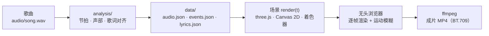

<div align="center">


# 小铭的视频基础引擎

**用代码一帧一帧画出音乐视频。**

画面跟着歌的节拍、段落和逐词歌词走，不用视频生成模型，也不用素材视频。<br>
2D、3D、横版、竖版都能做，导出 4K、带运动模糊。

[快速开始](#快速开始) · [做一支新 MV](#做一支新-mv) · [模块目录](docs/模块目录.md) · [引擎指南](docs/引擎指南.md)

</div>

<sub>上图截自用这套引擎做的 MV：《Falling Again》《Still Shining》。</sub>

## 它能做什么

- **跟着音乐走**：自动分析歌曲的节拍、小节、段落、各声部起音（底鼓、军鼓、镲……）和能量包络，场景里随时取用
- **逐词歌词**：歌词对齐到每个词的起止时间，唱到哪个词亮到哪个词；中英双语排版、中文逐字出现
- **任意一帧都能单独渲染**：画面是时间的纯函数，可以随意拖动预览、并行导出，导出时自动加运动模糊
- **2D 和 3D 都有现成模块**：手绘抽帧、纸片剧场、精灵视差、巨型字排版、油画滤镜、动画线稿；相机路径、景深、体积光、地形、体素、碎裂和传送门转场、MMD 模型
- **卡点检查**：场景登记关键动作，一条命令报告每个动作离目标拍子差几毫秒
- **成片检查**：响度、真峰值、空帧、闪光频率、色彩标签；还能按抖音码率重编码，看会不会出色带
- **发布工具**：抖音版合成（选段、锐化、淡出）、封面排版、Codex 批量生图

## 它是怎么工作的



每个场景是一个 TypeScript 类，负责歌里的一段时间。引擎给它当前时刻的节拍、声部强度和歌词，它把这一帧画出来。

## 快速开始

需要：[bun](https://bun.sh)、Node.js、Microsoft Edge（无头渲染用）、[ffmpeg](https://ffmpeg.org)、Python 3（音频分析和工具脚本用）。

```bash
git clone https://github.com/xiaoming6680/xm-video-engine.git
cd xm-video-engine/app
bun install
bunx vite
```

打开终端打印的地址（通常是 <http://localhost:5173>），就能看到自带的示例：一首合成的测试曲配 2D 和 3D 两段画面。空格播放，←/→ 跳 1 秒，`,`/`.` 逐帧。


渲染静帧和视频：

```bash
bun scripts/render.ts stills --t 3.1,12 --out ../out/stills     # 静帧
bun scripts/render.ts video --out ../out/demo.mp4               # 整段视频
bun scripts/render-par.ts --samples auto --out ../out/demo.mp4  # 多进程并行导出，带自适应运动模糊
```

## 做一支新 MV

```bash
python tools/new_project.py ../我的新MV --vertical  # 竖版；横版去掉 --vertical
cd ../我的新MV/app && bun install
```

然后：

1. 把歌放成 `audio/song.wav`，用 `analysis/` 里的脚本分离人声、分析节拍、对齐歌词
2. 在 `docs/TREATMENT.md`（从模板生成）里写下创意、色彩和分镜
3. 在 `app/src/scenes/` 写场景，在 `app/src/timeline.ts` 排时间线
4. 每轮预览用 `tools/qa/` 的脚本检查，再导出

完整步骤见 [新项目流程](docs/新项目流程.md)。

一个最小的场景长这样：

```ts
import type * as THREE from 'three';
import { Scene, type Frame } from '../engine/scene';
import { FSPass } from '../engine/gl';

export default class Pulse extends Scene {
  bg = new FSPass(`uniform float kick;
    void main() { fragColor = vec4(mix(C_INK, C_SIGNAL, kick * 0.5), 1.0); }`, { kick: { value: 0 } });

  render(f: Frame, out: THREE.WebGLRenderTarget) {
    this.bg.u.kick!.value = f.a.kick;   // 底鼓一响，画面跟着闪一下
    this.bg.render(this.ctx.renderer, out);
  }
}
```

## 目录

| 目录 | 内容 |
|---|---|
| `app/` | 引擎（TypeScript + three.js，bun + Vite）。`src/config.ts` 是项目设置，`src/engine/` 核心和模块，`src/kit/` 场景级辅助，`scripts/` 渲染脚本 |
| `analysis/` | 人声分离、节拍分析、声音事件、歌词对齐（Python） |
| `tools/` | 新建项目、质检、对照、生图、素材处理、抖音合成、封面 |
| `docs/` | [新项目流程](docs/新项目流程.md)、[模块目录](docs/模块目录.md)、[引擎指南](docs/引擎指南.md)、[质量验收](docs/质量验收.md)、[TREATMENT 模板](docs/TREATMENT模板.md)、[制作方法](docs/方法.md) |
| `third_party/` | 5 个开源动画工程的参考代码（笔刷、角色骨骼、画风说明），见 [说明](third_party/README.md) |

## 致谢

- 引擎核心来自 [mexicat/pdoom-video](https://github.com/mexicat/pdoom-video)（Giacomo Magnanini，MIT），即 MV《I'm Upping My P(doom)》的渲染引擎
- `third_party/` 收录了 [Lemo-Opuscar](https://github.com/lemomo-ai/lemo-opuscar)、[Papermotion](https://github.com/francozanardi/papermotion)、[claude-animation-skill](https://github.com/buildwithhanif/claude-animation-skill)、[Clearwater](https://github.com/Aureliengmz/clearwater)、[ClaudeAnimationBase](https://github.com/JohnHeibel/ClaudeAnimationBase) 的代码（均为 MIT）

## 许可

代码按 [MIT](LICENSE) 发布。`third_party/` 里的代码保留各自的许可（都是 MIT）。`app/public/fonts/` 里的字体保留各自的开源许可：Archivo、IBM Plex Mono、Cormorant Garamond、Noto Sans/Serif SC、Press Start 2P、EMS 单线字体为 OFL，Hershey 单线字体为 OFL / 公有领域。`audio/`、`data/` 里是脚本合成的测试曲，不含任何歌曲。
